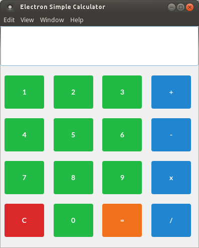
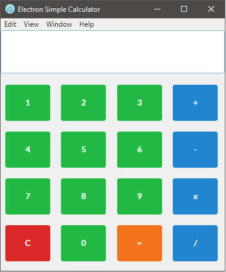

# simple-electron-calculator
this is a simple calculator powered by electron

for run this project, install electron with

npm install electron-prebuilt -g

and then run:

electron .

Screenshot(Linux):

Screenshot(Windows):

this program use Semantic UI whit MIT License

This example is licensed under MIT License.
